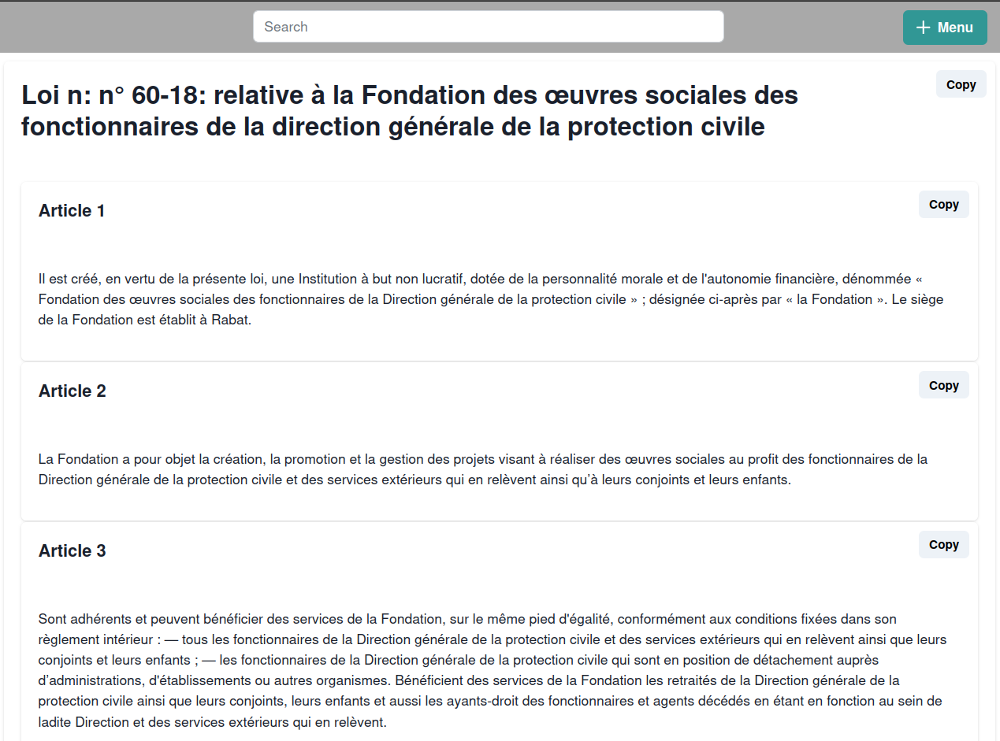
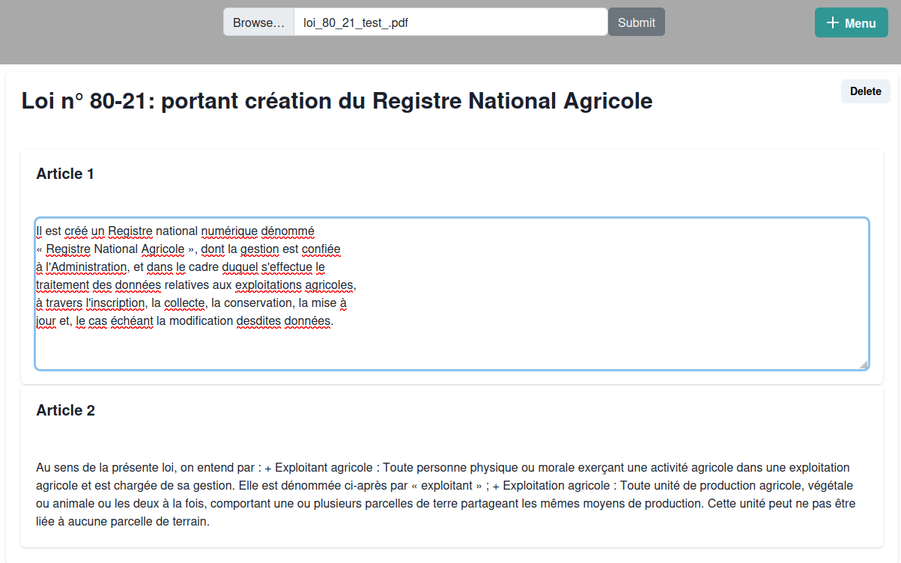
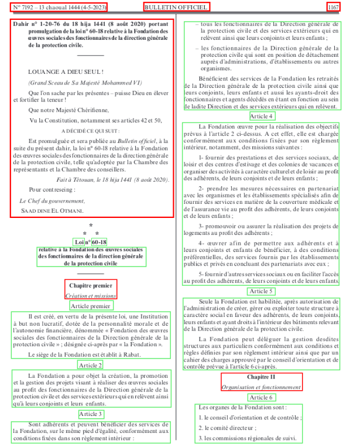

# OCR Law Extraction Web Application

## Summary 

- [Description](#Description)
- [Project Overview](#Project-Overview)
    - [User Roles](#User-Roles)
    - [Features](#Features)
- [ScreenShots](#ScreenShots)
- [Installation](#Installation)
    - [Prerequisites](#Prerequisites)
    - [Clone the Repository](#Clone-the-Repository)
    - [Backend Setup](#Backend-Setup)
    - [Frontend Setup](#Frontend-Setup)
    - [MongoDB Setup](#MongoDB-Setup)
    - [Tesseract OCR Installation](#Tesseract-OCR-Installation)
- [Technologies Used](#Technologies-Used)

## Description
This project was developed as part of my internship. The objective was to create a web application that applies Optical Character Recognition (OCR) on scanned PDF files to extract laws and their respective articles. The extracted information includes law numbers, titles, and detailed articles, which are then cleaned and stored in a structured format within a MongoDB database. This application is designed to facilitate the management and search of legal documents for both users and administrators.

## Project Overview

### User Roles

- **User**: Can search for laws and articles, and extract content from specific PDF files.
- **Admin**: Can add new laws via file uploads, manage existing laws and articles, and oversee other administrators.

### Features

- OCR processing of scanned PDFs to extract text.
- Search functionality for laws and articles.
- User-friendly interface for both users and admins.
- Data storage in MongoDB for efficient retrieval and management.

## ScreenShots

1. **User Dashboard**

 
2. **Extract Law**



3. **Cleaning The extracted Data**(Explication)



## Installation

### Prerequisites

Before you begin, ensure you have met the following requirements:

- You have installed Python (version 3.7 or higher).
- You have installed Node.js (version 12 or higher) and npm.
- You have installed MongoDB.
- You have installed Tesseract OCR (required for text extraction from images).

### Clone the Repository

```Bash
git clone https://github.com/abdelmaoulagr/pdf_ocr_app.git
cd pdf_ocr_app
```

### Backend Setup

1. Create a virtual environment and activate it:
```bash
python -m venv venv
source venv/bin/activate  # On Windows use `venv\Scripts\activate`
```
2. Install the required Python packages:
```bash
pip install -r requirements.txt
```

3. Start the Flask server:
```bash
export FLASK_APP=app.py  # On Windows use `set FLASK_APP=app.py`
flask run
```


### Frontend Setup
1. Navigate to the frontend directory:
```bash
cd frontend
```

2. Install the required npm packages:
```bash
npm install
```

3. Start the React development server:
```bash
npm start
```

### MongoDB Setup

Ensure MongoDB is running on your local machine or a remote server. Configure the connection settings in your backend configuration to point to your MongoDB instance.

### Tesseract OCR Installation

Follow the installation instructions for Tesseract OCR based on your operating system from the official documentation: [Tesseract Installation](https://tesseract-ocr.github.io/)

## Technologies Used
- **Languages**: HTML, CSS, JavaScript, TypeScript, Python
- **Frontend Framework**: React with Chakra UI and Bootstrap
- **Backend Framework**: Flask with libraries such as JSON, Base64, PyMongoDB, Pytesseract, pdf2image
- **Database**: MongoDB